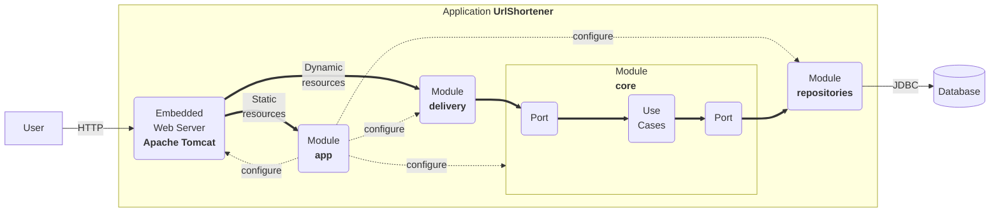

# Getting Started with the URL Shortener project

2024-10-22

## 1. Project description

This project consists of a Proof of Concept (PoC) which allows users to 
generate a short URL given a long one. The application also validates if 
the URL is rechable and safe before shortenening it. Moreover, it generates
a QR code for each shortened URL, which can be scanned to access the original 
one.

## Main functionalities
  - **QR code generation**: Esta funcionalidad permite generar un código QR para cada URL acortada. El código QR se 
   incluye en la respuesta cuando se acorta una URL, lo que permite a los usuarios compartir o escanear rápidamente 
   el enlace para facilitar el acceso.
  - **URL reachability check**: verifies if the given URL is reachable before
  shortening it.
  - **Google ssafe browsing integration**:
  - **Redirection limits**:


## 2. Libraries and frameworks

This application leverages cutting-edge technologies to deliver a robust
and versatile user experience:

1.  **Programming Language**: The application is written in [Kotlin
    2.0.20](https://kotlinlang.org/), a versatile, open-source,
    statically-typed language. Kotlin is renowned for its adaptability
    and is commonly used for Android mobile app development. Beyond
    that, it finds application in server-side development, making it a
    versatile choice.

2.  **Build System**: The application utilizes [Gradle
    8.5](https://gradle.org/) as its build system. Gradle is renowned
    for its flexibility in automating the software building process.
    This build automation tool streamlines tasks such as compiling,
    linking, and packaging code, ensuring consistency and reliability
    throughout development.

3.  **Framework**: The application employs [Spring Boot
    3.3.3](https://docs.spring.io/spring-boot/) as a framework. This
    technology requires Java 17 and is fully compatible up to and
    including Java 21. Spring Boot simplifies the creation of
    production-grade [Spring-based applications](https://spring.io/). It
    adopts a highly opinionated approach to the Spring platform and
    third-party libraries, enabling developers to initiate projects with
    minimal hassle.

## Justification for the choice of libraries

## 3. Challenges and solutions

During the elaboration of this Proof of Concept some challenges were encountered:
  - **QR code generation**: The implementation of QR code generation required selecting a library that could easily
  integrate with the project. After evaluating several options, we chose the zginx because it was not only simple to 
  use but also used in various GitHub projects, which gave us confidence.
  - **URL reachability check**: initially, this feature was implemented 
  asynchronously. But, given the fact that this part of the course was not 
  covered yet, for the PoC, it was implemented synchronously. It will be done
  asynchronously later on.
  - **Google safe browsing integration**:
  - **Redirection limits**: the first challenge encountered was deciding how to count the redirections of a shorturl in a period of time.To address this, a new method for the `clickRepositoryService` was implemented and the `RedirectUseCase` class was updated to be able to use this new method.
  Additionally, a new type of exception had to be defined and handled. This was done in a very similar way to the other exceptions. However, the `safeCall` function also required modification to ensure these new exceptions were not captured and treated as internal errors.

## Instructions to run the Proof of Concept

## Prerequisites 
  - Java 17
  - Gradle
  - Google Safe Browsing API key environment variable in .env file

## Steps
  1. Clone the repository
  2. Run the project with ./gradlew bootRun
  3. Application is available at http://localhost:8080

## Use example

## 5. Explanation of the tests

  - **QR code generation**: To validate that the QR code generation feature works correctly, the test 
  shouldReturnValidQRCode was implemented. This test simulates a request to shorten a URL and verifies that a QR code 
  is generated as part of the response. The test begins by checking that the HTTP response has a status of 201 CREATED 
  and that the location header and response body contain the expected shortened URL. Additionally, it ensures that the 
  QR code is included and that it follows the expected format (data:image/png;base64,). The base64 string is decoded, 
  and the resulting image is analyzed to confirm that it is valid and has positive dimensions (width and height greater
  than 0), ensuring that the QR code was successfully generated.
  - **URL reachability check**: For this feature, there are implemented two basic tests.
  The first one "should return true for a reachable URL" verifies that the service 
  validates correctly a reachable URL, meaning it returns code HTTP 200.
  The second one "should return false for an unreachable URL" verifies that the 
  service detects correctly an unreachable URL; it does not return code HTTP 200.
  - **Google safe browsing integration**:
  - **Redirection limits**: The first test for this new feature was implemented in the `RedirectUseCaseTest` class. It ensures that whenever the countsOnTimeRange method of the clickRepositoryService returns ***MAX_REDIRECTIONS***, a ***TooManyRequestsException*** is thrown the next time a redirection is attempted for that key.
  The second and final test was added to the `UrlShortenerControllerTest` class. It verifies that when a redirection triggers a ***TooManyRequestsException***, an **HTTP 429 status code** is returned, and no clicks are logged.


## Overall structure

The structure of this project is heavily influenced by [the clean
architecture](https://blog.cleancoder.com/uncle-bob/2012/08/13/the-clean-architecture.html):

- A `core` module where we define the domain entities and the
  functionalities (also known as use cases, business rules, etc.). They
  do not know that this application has a web interface or that data is
  stored in relational databases.
- A `repositories` module that knows how to store domain entities in a
  relational database.
- A `delivery` module that knows how to expose the functionalities on
  the web.
- An `app` module that contains the main application, the configuration
  (i.e., it links `core`, `delivery`, and `repositories`), and the
  static assets (i.e., HTML files, JavaScript files, etc.).



Usually, if you plan to add a new feature:

- You will add a new use case to the `core` module.
- If required, you will modify the persistence model in the
  `repositories` module.
- You will implement a web-oriented solution to expose it to clients in
  the `delivery` module.

Sometimes, your feature will not be as simple, and it may require:

- Connecting to a third party (e.g., an external server). In this case,
  you will add a new module named `gateway` responsible for such a task.
- An additional application. In this case, you can create a new
  application module (e.g., `app2`) with the appropriate configuration
  to run this second server.

Features that require connecting to a third party or having more than a
single app will be rewarded.

## Run

The application can be run as follows:

``` bash
./gradlew bootRun
```

Now you have a shortener service running at port 8080. You can test that
it works as follows:

``` bash
$ curl -v -d "url=http://www.unizar.es/" http://localhost:8080/api/link
*   Trying ::1:8080...
* Connected to localhost (::1) port 8080 (#0)
> POST /api/link HTTP/1.1
> Host: localhost:8080
> User-Agent: curl/7.71.1
> Accept: */*
> Content-Length: 25
> Content-Type: application/x-www-form-urlencoded
> 
* upload completely sent off: 25 out of 25 bytes
* Mark bundle as not supporting multiuse
< HTTP/1.1 201 
< Location: http://localhost:8080/tiny-6bb9db44
< Content-Type: application/json
< Transfer-Encoding: chunked
< Date: Tue, 28 Sep 2021 17:06:01 GMT
< 
* Connection #0 to host localhost left intact
{"url":"http://localhost:8080/tiny-6bb9db44","properties":{"safe":true}}%   
```

And now, we can navigate to the shortened URL.

``` bash
$ curl -v http://localhost:8080/6bb9db44
*   Trying ::1:8080...
* Connected to localhost (::1) port 8080 (#0)
> GET /tiny-6bb9db44 HTTP/1.1
> Host: localhost:8080
> User-Agent: curl/7.71.1
> Accept: */*
> 
* Mark bundle as not supporting multiuse
< HTTP/1.1 307 
< Location: http://www.unizar.es/
< Content-Length: 0
< Date: Tue, 28 Sep 2021 17:07:34 GMT
< 
* Connection #0 to host localhost left intact
```

## Build and Run

The uberjar can be built and then run with:

``` bash
./gradlew build
java -jar app/build/libs/app-0.2024.1-SNAPSHOT.jar
```

## Functionalities

The project offers a minimum set of functionalities:

- **Create a short URL**. See in `core` the use case
  `CreateShortUrlUseCase` and in `delivery` the REST controller
  `UrlShortenerController`.

- **Redirect to a URL**. See in `core` the use case `RedirectUseCase`
  and in `delivery` the REST controller `UrlShortenerController`.

- **Log redirects**. See in `core` the use case `LogClickUseCase` and in
  `delivery` the REST controller `UrlShortenerController`.

The objects in the domain are:

- `ShortUrl`: the minimum information about a short URL
- `Redirection`: the remote URI and the redirection mode
- `ShortUrlProperties`: a handy way to extend data about a short URL
- `Click`: the minimum data captured when a redirection is logged
- `ClickProperties`: a handy way to extend data about a click

## Delivery

The above functionality is available through a simple API:

- `POST /api/link` which creates a short URL from data send by a form.
- `GET /{id}` where `{id}` identifies the short URL, deals with
  redirects, and logs use (i.e. clicks).

In addition, `GET /` returns the landing page of the system.

## Repositories

All the data is stored in a relational database. There are only two
tables.

- **shorturl** that represents short URLs and encodes in each row
  `ShortUrl` related data,
- **click** that represents clicks and encodes in each row `Click`
  related data.

## Reference Documentation

For further reference, please consider the following sections:

- [Official Gradle documentation](https://docs.gradle.org)
- [Spring Boot Gradle Plugin Reference
  Guide](https://docs.spring.io/spring-boot/docs/current/gradle-plugin/reference/htmlsingle/)
- [Spring
  Web](https://docs.spring.io/spring-boot/reference/web/index.html)
- [Spring SQL
  Databases](https://docs.spring.io/spring-boot/reference/data/sql.html)

## Guides

The following guides illustrate how to use some features concretely:

- [Building a RESTful Web
  Service](https://spring.io/guides/gs/rest-service/)
- [Serving Web Content with Spring
  MVC](https://spring.io/guides/gs/serving-web-content/)
- [Building REST services with
  Spring](https://spring.io/guides/tutorials/rest/)
- [Accessing Data with
  JPA](https://spring.io/guides/gs/accessing-data-jpa/)
